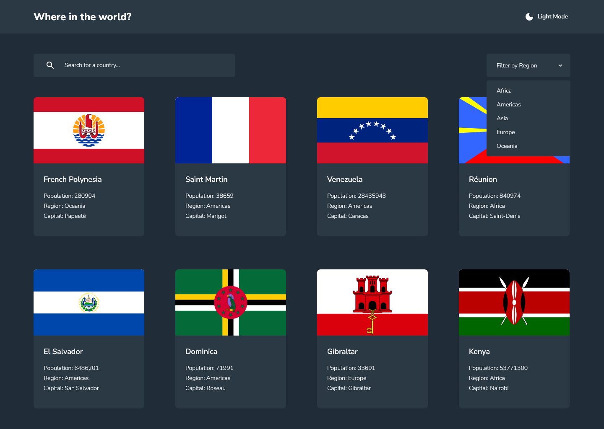
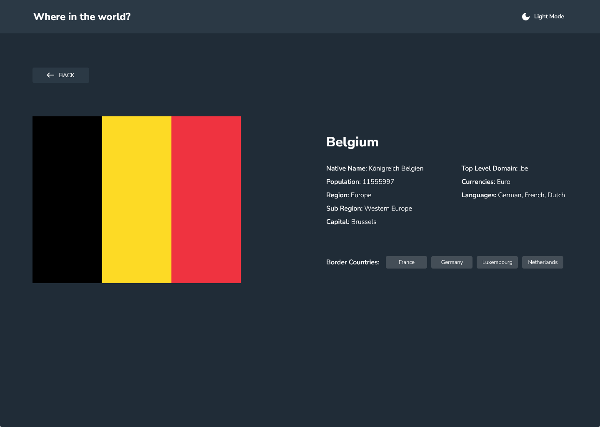

# Frontend Mentor - REST Countries API with color theme switcher solution

This is a solution to the [REST Countries API with color theme switcher challenge on Frontend Mentor](https://www.frontendmentor.io/challenges/rest-countries-api-with-color-theme-switcher-5cacc469fec04111f7b848ca). Frontend Mentor challenges help you improve your coding skills by building realistic projects. 

## Table of contents

- [Overview](#overview)
  - [The challenge](#the-challenge)
  - [Screenshot](#screenshot)
  - [Links](#links)
- [My process](#my-process)
  - [Built with](#built-with)
  - [What I learned](#what-i-learned)
  - [Continued development](#continued-development)
  - [Useful resources](#useful-resources)
- [Author](#author)
- [Acknowledgments](#acknowledgments)

## Overview

### The challenge

Users should be able to:

- See all countries from the API on the homepage
- Search for a country using an `input` field
- Filter countries by region
- Click on a country to see more detailed information on a separate page
- Click through to the border countries on the detail page
- Toggle the color scheme between light and dark mode *(optional)*

### Screenshot

### Links

- Solution URL: [https://github.com/keeplearning211/rest-countries-api-with-color-theme-switcher](https://github.com/keeplearning211/rest-countries-api-with-color-theme-switcher)
- Live Site URL: [https://keeplearning211.github.io/rest-countries-api-with-color-theme-switcher/](https://keeplearning211.github.io/rest-countries-api-with-color-theme-switcher/)

## My process

### Built with

- [React](https://reactjs.org/) - JS library for building user interfaces
- [React Router](https://reactrouter.com/en/main) - A powerful and easy-to-use routing library for React application
- [Redux toolkit query](https://redux.js.org/usage/writing-logic-thunks#fetching-data-with-rtk-query) - A data fetching and caching library that simplifies common cases for loading data in a web application. RTK Query is built on top of the Redux Toolkit core and leverages RTK's APIs like createSlice and createAsyncThunk to implement its capabilities.
- [TypeScript](https://www.typescriptlang.org/) - A superset of JavaScript that adds static types.
- [Mui](https://mui.com/) - A powerful and versatile React component library that can help you build beautiful and user-friendly React applications
- [Vite](https://vitejs.dev/) - Build tool for faster and leaner development

### What I learned

- I learned how to customize styles within a React app using the [MUI](https://mui.com/) library. This included leveraging MUI's theming capabilities to ensure a consistent look and feel across the application, using its responsive design system to ensure the app looks great on all device sizes, and utilizing its pre-built components to speed up development time.
## Author

This project was created by [keeplearning211](https://www.frontendmentor.io/profile/keeplearning211), a dedicated developer and participant in the Frontend Mentor challenges.

## Acknowledgments

I would like to express my gratitude to:

- [ErickKS](https://github.com/ErickKS) for his [vite-react-router-deploy](https://github.com/ErickKS/vite-react-router) repository. It was an invaluable resource during the deployment phase of my project.
- [TypeScript](https://www.typescriptlang.org/), a superset of JavaScript that adds static types, for enhancing the reliability of my code.
- [React](https://reactjs.org/), a JS library for building user interfaces, for providing the foundation of my application.
- [React Router](https://reactrouter.com/en/main) - A powerful and easy-to-use routing library for React application.
- [Redux toolkit query](https://redux.js.org/usage/writing-logic-thunks#fetching-data-with-rtk-query) - A data fetching and caching library that simplifies common cases for loading data in a web application. 
- [Mui](https://mui.com/), a powerful and versatile React component library that can help you build beautiful and user-friendly React applications.
- [Vite](https://vitejs.dev/), a build tool, for speeding up the development process.
